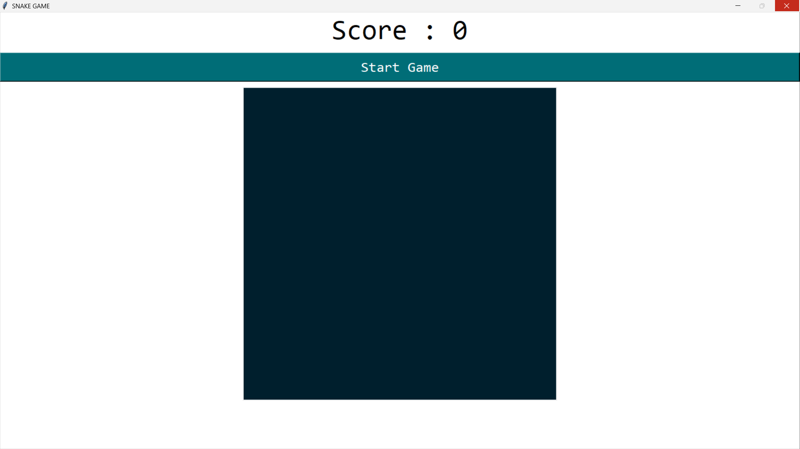
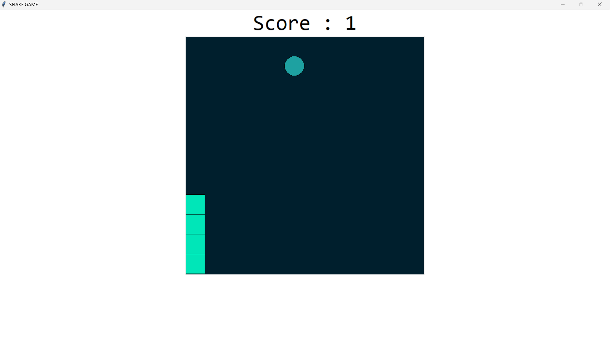
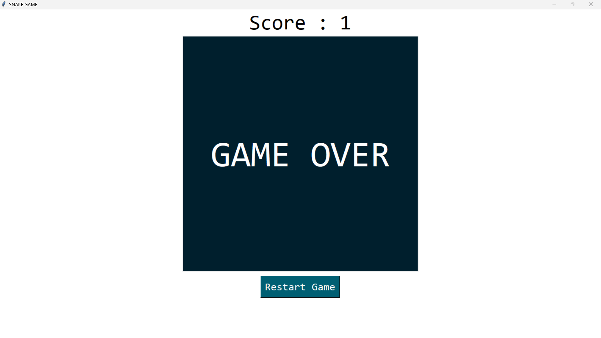

# Snake Game in Python 🐍

Hey there...!  
This is a simple Snake game I built using Python and Tkinter. It's just like the classic one, but with a clean ocean-style color theme and a smooth GUI.

---

## 🎮 Features
- Arrow key controls to move the snake
- Start and Restart buttons
- Score tracker
- Aesthetic ocean vibe 🌊

---

##  How to Run the Game

Make sure you have Python installed on your system.

Then:

1. Download or clone this repo
2. Open a terminal inside the project folder
3. Run this command:

```bash
python "snake game.py"

## 📸 Screenshots

### Start Screen


### Gameplay


### Game Over Screen
 
.
